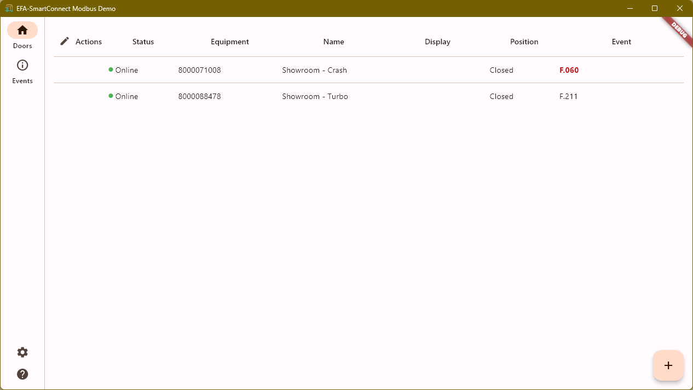
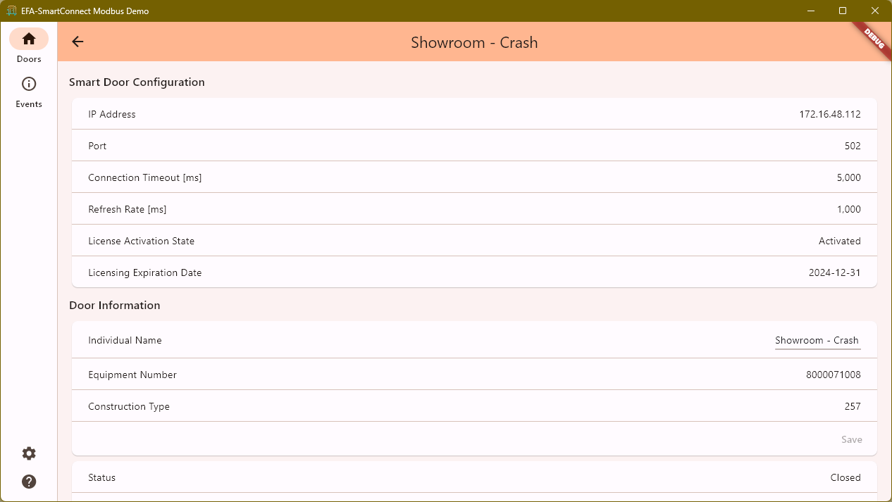
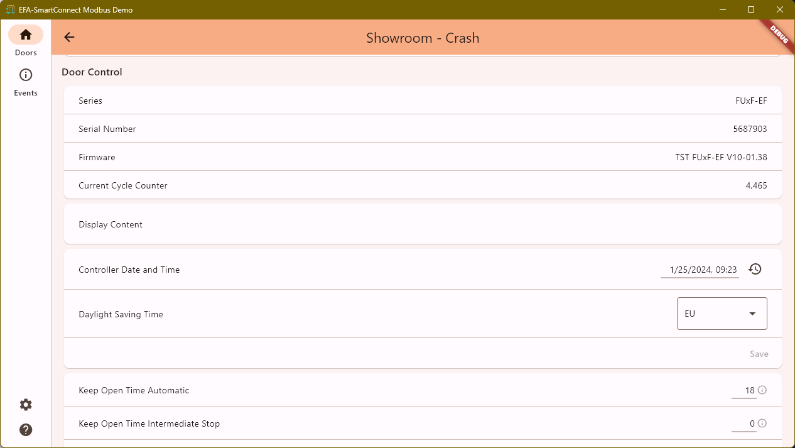
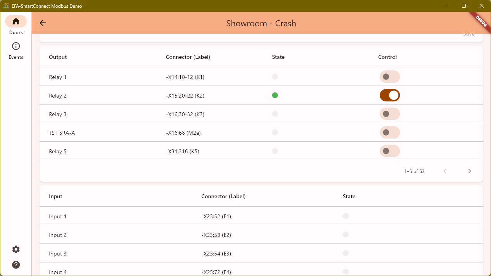
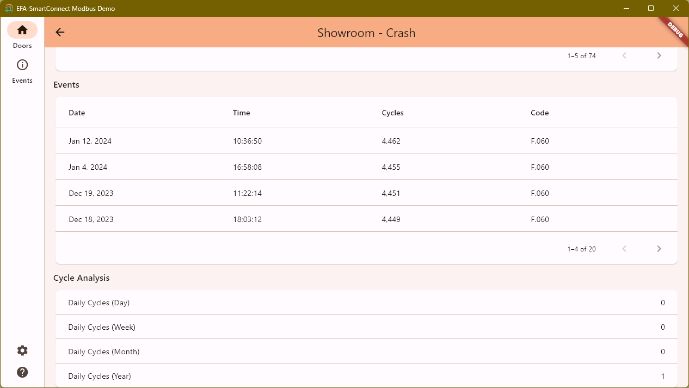
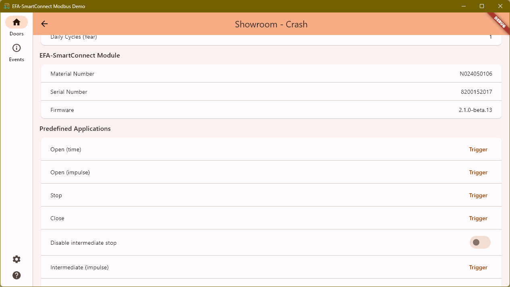
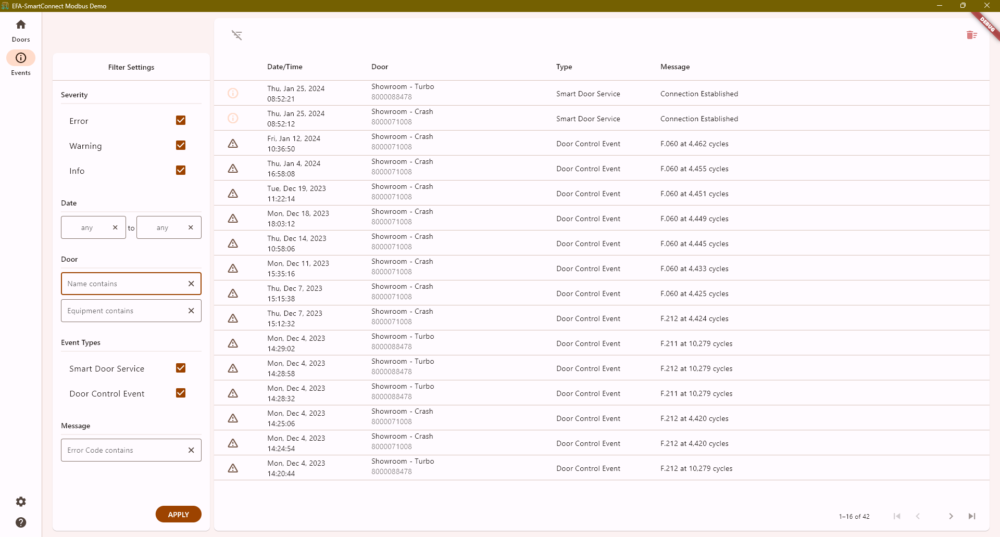
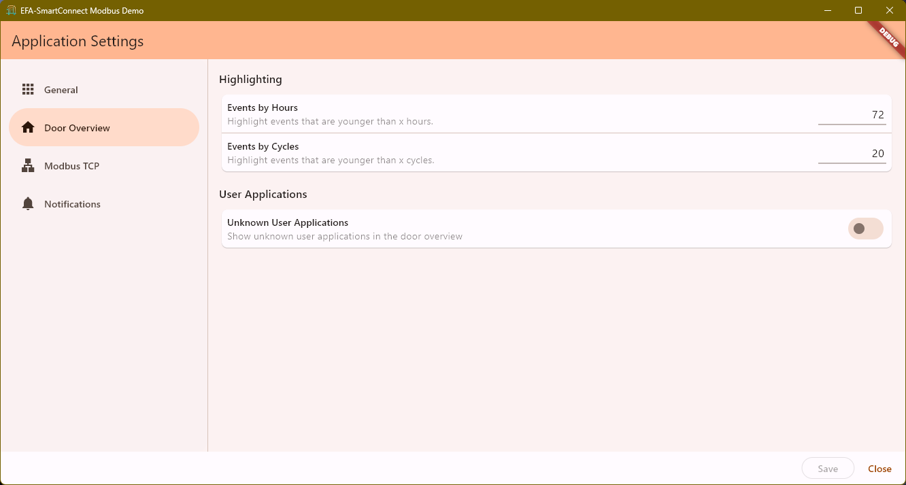
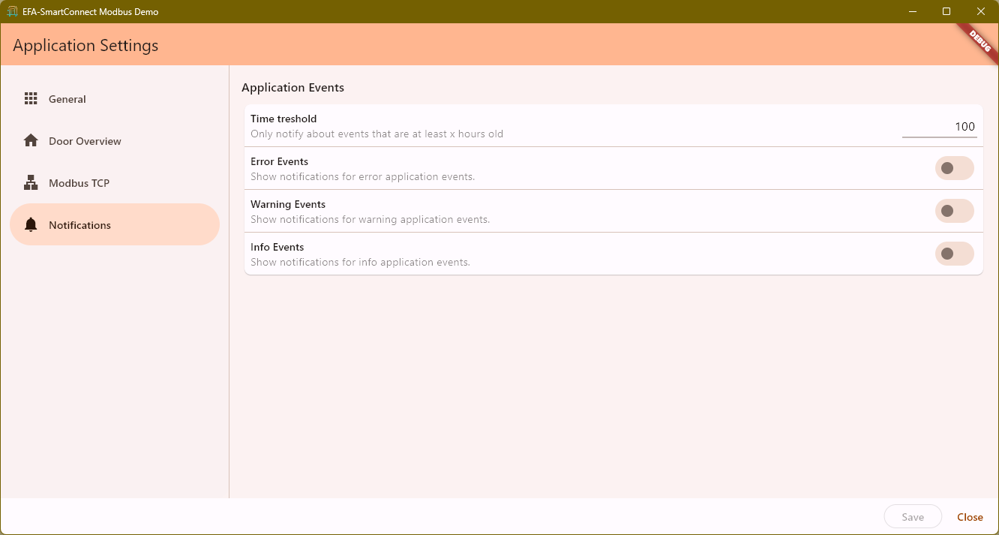

[](https://github.com/EfaflexGithub/esc-sb-demo/actions/workflows/ci.yml)

# EFA-SmartConnect Building Automation Demo


## Overview

The EFA-SmartConnect Module Demo App is an open source demonstration application that showcases the capabilities and functionalities of the EFA-SmartConnect® Module. This module supports both WiFi and Ethernet connections and serves as an extension board for the EFA-TRONIC® door control.

## Key Features

- **Modbus Interface Support:** Communicate seamlessly with the EFA-SmartConnect Module through the Modbus interface.
- **Door Status:** Monitor the current status of doors in real-time.
- **Recent Events:** View a log of recent events related to the connected doors.
- **Door Interaction:** Open, close, and control outputs of the connected doors directly from the application.
- **Parameter Configuration:** Change basic parameters of the door control to customize the behavior.
- **Input and Output Status:** Read the status of inputs and outputs associated with the doors.

## Screenshot



[Further Screenshots](#screenshots)

# Trying

Download the Windows x64 installer to quickly set up the EFA-SmartConnect Module Demo App on your Windows machine. No admin rights required.

[Latest Release](https://github.com/EfaflexGithub/esc-sb-demo/releases/latest)

# Contributing

We welcome contributions from the community. If you have any ideas, bug reports, or feature requests, feel free to open an issue or submit a pull request.

## Prerequisites

- [Flutter](https://flutter.dev/) installed on your development environment.

## Installation

1. On Windows: Enable Developer Mode:

   ```bash
   start ms-settings:developers
   ```

2. Clone the repository:

   ```bash
   git clone https://github.com/EfaflexGithub/esc-sb-demo.git
   ```

3. Navigate to the project directory:

   ```bash
   cd esc-sb-demo
   ```

4. Install dependencies:

   ```bash
   flutter pub get
   ```

5. Run code generator:

   ```bash
   dart run build_runner build
   ```

## Usage

Run the application on an emulator or connected device:

```bash
flutter run
```

# License

This project is licensed under the [GNU General Public License v3.0](LICENSE.md).

# Links

## EFA-SmartConnect

[EFAFLEX - EFA-SmartConnect®](https://link.efaflex.com/nvuf)

## EFA-SmartConnect App

- [Apple App Store](https://link.efaflex.com/3z4ez)
- [Google Play Store](https://link.efaflex.com/ujs88)

## EFA-SmartConnect Building Automation

- [Modbus Documentation](https://link.efaflex.com/kgf4b)
- [EFA-SmartBuilding API](https://link.efaflex.com/6afi)

## Screenshots
















